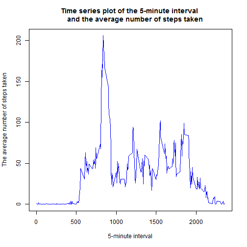
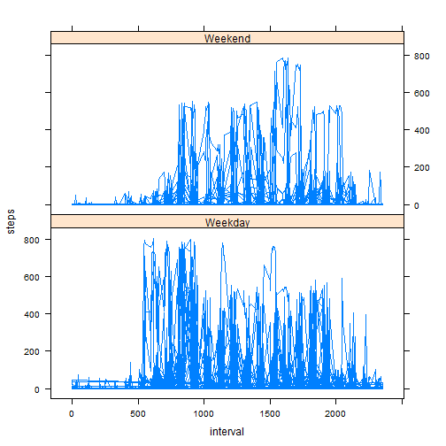

1.Loading and preprocessing the data


```r
setInternet2(TRUE)
url<- "https://d396qusza40orc.cloudfront.net/repdata%2Fdata%2Factivity.zip"
download.file(url,destfile="activity.zip",mode="wb")
unzip("activity.zip")
unzip("activity.zip",list=TRUE)
```

```
##           Name Length                Date
## 1 activity.csv 350829 2014-02-11 10:08:00
```

```r
activity1<-read.csv("activity.csv")
```

2.What is mean total number of steps taken per day?

Ignore the missing values in the dataset.


```r
data <- na.omit(activity1)
```

Make a histogram of the total number of steps taken each day:


```r
library(sqldf)
```

```
## Loading required package: gsubfn
## Loading required package: proto
## Loading required package: RSQLite
## Loading required package: DBI
## Loading required package: RSQLite.extfuns
```

```r
subdata1<- sqldf("select date, sum(steps) as steps from data group by date")
```

```
## Loading required package: tcltk
```

```r
library(ggplot2)
ggplot(subdata1, aes(x=steps)) + geom_histogram()
```

```
## stat_bin: binwidth defaulted to range/30. Use 'binwidth = x' to adjust this.
```

 

Calculate and report the mean and median total number of steps taken per day


```r
media1<- mean(subdata1$steps)
mediana1<- median(subdata1$steps)
cat("Mean of total number of steps taken per day (ignoring the missing values) is: ", media1)
```

```
## Mean of total number of steps taken per day (ignoring the missing values) is:  10766
```

```r
cat("Median of total number of steps taken per day (ignoring the missing values) is: ", mediana1)
```

```
## Median of total number of steps taken per day (ignoring the missing values) is:  10765
```

3.What is the average daily activity pattern?

Make a time series plot (i.e. type = "l") of the 5-minute interval (x-axis) and the average number of steps taken, averaged across all days (y-axis)


```r
subdata2<- sqldf("select interval, avg(steps) as steps from data group by interval")
plot(subdata2$interval,subdata2$steps,main="Time series plot of the 5-minute interval 
     and the average number of steps taken",xlab="5-minute interval",
     ylab="The average number of steps taken",type= "l", col="blue")
```

 

Which 5-minute interval, on average across all the days in the dataset,
contains the maximum number of steps?


```r
print("The interval containing the maximum number of steps and the maximum number of steps are: ")
```

```
## [1] "The interval containing the maximum number of steps and the maximum number of steps are: "
```

```r
print(sqldf("select interval, max(steps) from subdata2"))
```

```
##   interval max(steps)
## 1      835        206
```

4.Imputing missing values
Calculate and report the total number of missing values in the dataset
(i.e. the total number of rows with NAs)


```r
cat("The total number of missing values in the dataset is: ", nrow(activity1)- nrow(data))
```

```
## The total number of missing values in the dataset is:  2304
```

Devise a strategy for filling in all of the missing values in the dataset. Create a new dataset that is equal to the original dataset but with the missing data filled in.


```r
library(plyr)
impute.mean <- function(x) replace(x, is.na(x), mean(x, na.rm = TRUE))
activity2 <- ddply(activity1[1:3], .(interval), transform, steps = impute.mean(steps),date = date,interval = interval)
activity2 <- activity2[order(activity2$date, activity2$interval),]
row.names(activity2) <- 1:nrow(activity2)
```

Make a histogram of the total number of steps taken each day and calculate and report the mean and median total number of steps taken per day. 


```r
subdata3<- sqldf("select date, sum(steps) as steps from activity2 group by date")
ggplot(subdata3, aes(x=steps)) + geom_histogram()
```

```
## stat_bin: binwidth defaulted to range/30. Use 'binwidth = x' to adjust this.
```

 

```r
media2<- mean(subdata3$steps)
mediana2<- median(subdata3$steps)
cat("Mean of total number of steps taken per day (filling in the missing values) is: ", media2)
```

```
## Mean of total number of steps taken per day (filling in the missing values) is:  10766
```

```r
cat("Median of total number of steps taken per day (filling in the missing values) is: ", mediana2)
```

```
## Median of total number of steps taken per day (filling in the missing values) is:  10766
```

Do these values differ from the estimates from the first part of the assignment?
What is the impact of imputing missing data on the estimates of the total daily number of steps?


```r
cat("The difference between means after filling the missing values is: " ,media2-media1)
```

```
## The difference between means after filling the missing values is:  0
```

```r
cat("The difference between medians after filling the missing values is: " ,mediana2-mediana1)
```

```
## The difference between medians after filling the missing values is:  1.189
```

5.Are there differences in activity patterns between weekdays and weekends?
Create a new factor variable in the dataset with two levels - "weekday" and "weekend" indicating whether a given date is a weekday or weekend day.


```r
newdata<- activity2
newdata$dayOfWeek <- weekdays(as.Date(newdata$date))
newdata$dayType <- ifelse(newdata$dayOfWeek== "Saturday" | newdata$dayOfWeek== "Sunday", "Weekend", "Weekday")
newdata$dayType<- factor(newdata$dayType)
```

Make a panel plot containing a time series plot (i.e. type = "l") of the 5-minute interval (x-axis) and the average number of steps taken, averaged across all weekday days or weekend days (y-axis).


```r
library(lattice)
xyplot(steps ~ interval | dayType, data = newdata, layout = c(1, 2), type= "l")
```

 

